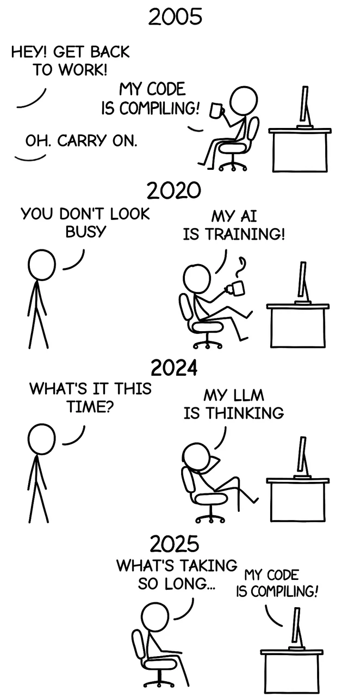

# Task 3: Understanding Quantization - a method to run LLMs on small devices

The details for this task are provided in the Google Colab notebook linked below:

[Link to Google Colab](https://colab.research.google.com/drive/1X2D89jCL1kvnqXYCEbZKPLXU6aoVU5NX?usp=sharing)

Open the notebook with your *BITS email ID*. You can either create a copy and work on it on colab (recommended) or download it and work on it locally.

Once you have completed the task, please save the notebook and place it within this folder with the filename `DashLab_SysML_t3_2025_<Your BITS ID>.ipynb`.

